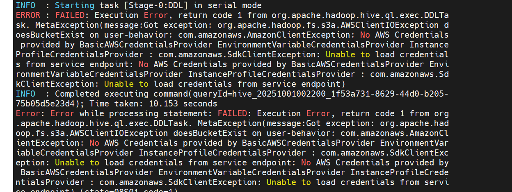

### 张喜翔 日志 
#### 今日任务安装成功 minion 并且上传csv文件对hive 进行映射

一、MinIO 本地部署

1.1 环境准备

mkdir -p /opt/soft
cd /opt/soft

1.2 下载与安装

下载 MinIO

wget https://dl.min.io/server/minio/release/linux-amd64/minio

(# 授予执行权限)

chmod +x minio

1.3 数据目录配置

mkdir -p /opt/soft/minio-data

#设置目录权限

chown -R root:root /opt/soft/minio-data

1.4 启动 MinIO 服务

#进入安装目录
cd /opt/soft

#启动 MinIO 服务（端口可自定义）
sudo ./minio server /opt/soft/minio-data --console-address ":19002" --address ":19000"

二、MinIO 基本操作测试

2.1 访问管理界面
打开浏览器访问：http://cdh01:19002

使用默认凭证登录：

用户名：minioadmin

密码：minioadmin

2.2 创建存储桶和目录
点击 Create Bucket 创建存储桶（如：hive-data）

在存储桶中创建目录：ds=20250925

上传 CSV 测试文件

三、Hive 集成配置
3.1 配置 HDFS 连接 MinIO
通过 CDH Manager 修改 core-site.xml 配置：
    
    <configuration>
    
      <!-- MinIO 配置 -->
    
      <property>
    
        <name>fs.s3a.endpoint</name>
    
        <value>http://cdh01:19000</value>
    
      </property>
    
      <property>
    
        <name>fs.s3a.access.key</name>
    
        <value>minioadmin</value>
    
      </property>
    
      <property>
    
        <name>fs.s3a.secret.key</name>
    
        <value>minioadmin</value>
    
      </property>
    
      <property>
    
        <name>fs.s3a.path.style.access</name>
    
        <value>true</value>
    
      </property>
    
      <property>
    
        <name>fs.s3a.impl</name>
    
        <value>org.apache.hadoop.fs.s3a.S3AFileSystem</value>
    
      </property>
    
    </configuration>

3.2 重启服务
HDFS

Hive Server2

Hive Metastore

四、问题与解决方案

4.1 遇到的问题：Hive 连接 MinIO 认证失败

错误信息：
No AWS Credentials provided by BasicAWSCredentialsProvider

4.2 解决方案：使用 HDFS 中转方案

准备测试数据

#创建 CSV 测试文件

cat > /tmp/user_behavior.csv << 'EOF'
user_id,user_name,action_type,product_id,amount,action_time
1001,张三,login,P001,0,2025-09-25 08:30:00
1002,李四,purchase,P005,299.9,2025-09-25 09:15:25
1003,王五,view,P012,0,2025-09-25 10:45:10
1004,赵六,purchase,P008,599.0,2025-09-25 11:20:35
1005,钱七,logout,P001,0,2025-09-25 12:05:40
1001,张三,purchase,P003,150.5,2025-09-25 14:30:15
1003,王五,purchase,P012,899.0,2025-09-25 15:45:30
1002,李四,view,P007,0,2025-09-25 16:20:05
1004,赵六,login,P001,0,2025-09-25 17:10:50
1005,钱七,purchase,P015,420.0,2025-09-25 18:35:20
EOF

上传数据到 HDFS

#创建 HDFS 目录结构
hadoop fs -mkdir -p /user/hive/warehouse/behavior_analysis.db/user_actions/ds=20250925

#上传 CSV 文件到 HDFS
hadoop fs -put /tmp/user_behavior.csv /user/hive/warehouse/behavior_analysis.db/user_actions/ds=20250925/

步骤3：创建 Hive 外部表

-- 创建数据库
CREATE DATABASE IF NOT EXISTS behavior_analysis;
USE behavior_analysis;

-- 创建基于 HDFS 的外部表
CREATE EXTERNAL TABLE behavior_analysis.user_actions (
user_id INT,
user_name STRING,
action_type STRING,
product_id STRING,
amount DOUBLE,
action_time STRING
)
PARTITIONED BY (ds STRING)
ROW FORMAT DELIMITED
FIELDS TERMINATED BY ','
STORED AS TEXTFILE
LOCATION 'hdfs:///user/hive/warehouse/behavior_analysis.db/user_actions/'
TBLPROPERTIES ('skip.header.line.count'='1');

-- 添加分区
ALTER TABLE behavior_analysis.user_actions ADD PARTITION (ds='20250925');

验证数据查询

-- 测试查询

SELECT * FROM behavior_analysis.user_actions WHERE ds='20250925' LIMIT 5;

