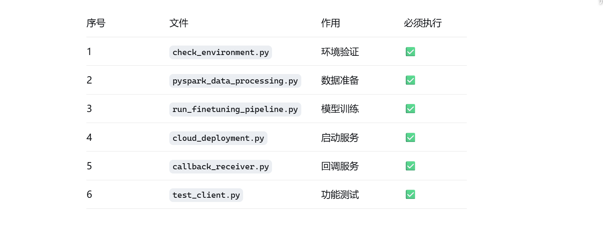

### Qwen 技术实现文档

### 📋 项目需求概述

### 4.1 Qwen模型双模式部署

📁 文件功能说明

环境检查

check_environment.py - 检查 Java 和 PySpark 环境是否正常

数据处理

pyspark_data_processing.py - 使用 PySpark 处理地址数据，生成训练样本

simple_data_processing.py - PySpark 失败时的备用数据处理方案

sample_address_data.json - 示例地址数据集

模型微调

lora_finetuning.py - 标准的 LoRA 微调实现（需要网络下载模型）

fully_offline_finetune.py - 完全离线的 LoRA 微调方案

run_finetuning_pipeline.py - 完整的微调流水线控制器

云端服务

cloud_deployment.py - 云端 API 服务，提供同步/异步接口

callback_receiver.py - 回调通知接收器

test_client.py - API 客户端测试工具

模型测试

test_finetuned_model.py - 测试微调后模型的地址处理能力

💻 部署环境说明

部署方式: 在 Windows 上使用 Ollama 部署 Qwen 模型

选择原因: 无法连接外网，无法使用 VLLM 框架

当前状态: Ollama 本地部署成功，模型可正常调用

 ### 执行流程

环境检查 → 2. PySpark数据处理 → 3. LoRA微调训练 → 4. 模型部署测试

### 第一阶段：环境准备

    # 1. 检查环境
    python check_environment.py
    
    # 2. 确保Ollama服务运行（手动）
    ollama serve

### 第二阶段：数据处理和模型训练

    # 3. 使用PySpark处理数据
    python pyspark_data_processing.py
    
    # 4. 运行完整微调流水线
    python run_finetuning_pipeline.py

### 第三阶段：部署和测试

        # 5. 启动云端服务（新终端）
    python cloud_deployment.py
    
    # 6. 启动回调接收器（新终端）  
    python callback_receiver.py
    
    # 7. 测试API服务
    python test_client.py

### 第四阶段：性能测试（可选）

    # 8. 测试微调模型效果
    python test_finetuned_model.py
    
    # 9. 对比CPU/GPU性能
    python compare_deployment.py

### 📋 核心必执行文件

https://chat.deepseek.com/a/chat/s/a904e293-8b1a-43f7-8841-61389e041b36

###  💡 注意事项

先启动Ollama: 确保 ollama serve 在后台运行

分终端运行: 云端服务和回调接收器需要不同终端

按顺序执行: 确保前一步完成再执行下一步

    