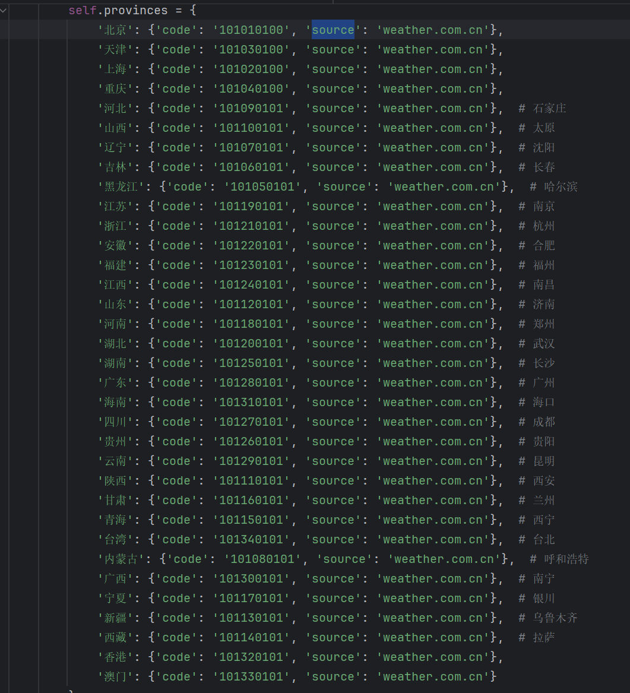
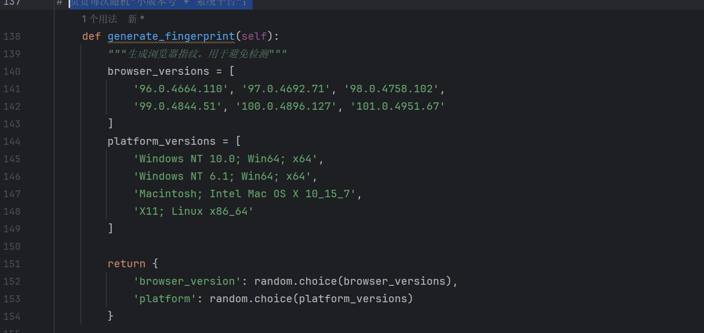
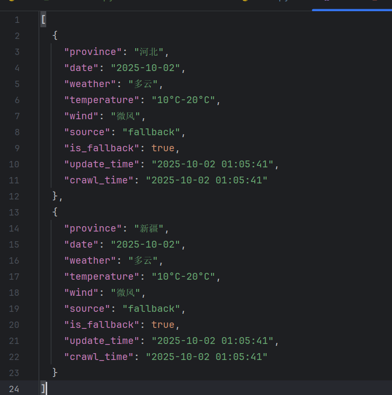
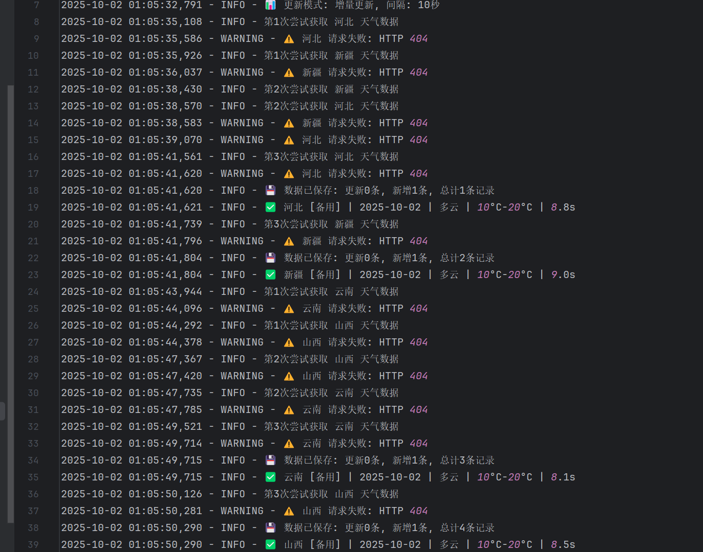

### 张喜翔 10月1 任务 python spider 爬⾍

### 这些代码均可在Linux里执行 前提是给运用的库都给下载一下 并且 python 版本升级成 3.11版本的

1.爬取中国⽓象数据, 数据要求 10 s 更新⼀次，增量更新

1.1 我采取的网站是
https://weather.cma.cn/
1.2 我运用的方法是  
  

步骤一：通过省份独特编码进行解析    \
步骤二：通过了 setup_enhanced_antibot 他的是意思 给你“会重试、长连接、带伪装头”的会话； \
步骤三：增加一个 负责每次随机“小版本号 + 系统平台”；\

步骤四： 结合前面 步骤 二、三 为 把指纹变成一条完整、自洽、可随时替换的浏览器请求头。 \
三者配合，让爬虫每一次访问都像“不同真人用不同电脑/浏览器”在刷新页面，封 IP 或者 封账号的概率大幅下降。

效果图
 \
日志

2.爬取中国外汇当⽇市场数据数据 10 s 更新⼀次，增量更新
2.1 我采取的网站是 \
https://api.frankfurter.app/latest?from=USD \
他是一个公开 外汇交易 api

2.2 其他反扒设置跟 第一题一样

        