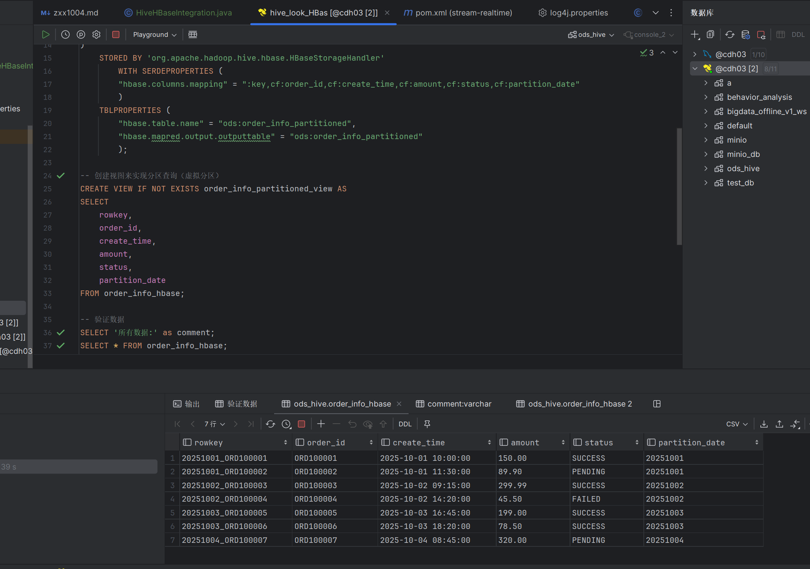

##张喜翔 10.4 日志 flink 写入HBase

### Flink写入HBase使⽤ hive 和 hbase 的映射表进⾏映射, 数据需要可查询, 实现可分区为佳

### Flink写入HBase问题解决全记录

### 问题概述

在开发Flink作业将订单数据写入HBase的过程中，遇到了两个主要问题：

1. HDFS健康状态异常 - 安全模式开启且有损坏数据块

2.  HBase命名空间不存在 - 无法在ods命名空间下创建表

问题一：HDFS健康状态异常

错误现象

HDFS处于安全模式（Safe mode is ON）

存在损坏的数据块（Blocks with corrupt replicas: 3）

大量DataNode报告运行状况不良

诊断命令及结果

    hdfs dfsadmin -report

输出显示：

        Safe mode is ON
    Configured Capacity: 136168667136 (126.82 GB)
    Present Capacity: 77021151232 (71.73 GB)
    DFS Remaining: 74028396544 (68.94 GB)
    DFS Used: 2992754688 (2.  79 GB)
    DFS Used%: 3.   89%
    Replicated Blocks:
    Under replicated blocks: 0
    Blocks with corrupt replicas: 3
    Missing blocks: 0

问题分析

1. 安全模式开启：HDFS处于只读状态，无法写入新数据

2.  损坏数据块：3个HBase WAL文件损坏，触发了安全模式

3.   节点资源不均：cdn01节点系统空间使用过多（27.76GB）

解决方案

步骤1：退出安全模式

    hdfs dfsadmin -safemode leave

步骤2：检查损坏数据块

    hdfs fsck / -list-corruptfileblocks

输出显示3个损坏的HBase WAL文件：

    /hbase/WALs/cdh01,16020,1759241036838/cdh03%2C16020%2C1759241036838.cdh03%2C16020%2C1759241036838.reglongroup-0.1759255447030
    /hbase/WALs/cdh01,16020,1759241036930/cdh03%2C16020%2C1759241036930.cdh03%2C16020%2C1759241036930.reglongroup-0.1759255446843
    /hbase/WALs/cdh01,16020,1759241036747/cdh03%2C16020%2C1759241036747.cdh03%2C16020%2C1759241036747.reglongroup-0.1759255447380

步骤3：删除损坏文件

    hdfs fsck / -delete

步骤4：验证修复结果

    hdfs fsck /

输出显示：

    Status: HEALTHY
    Number of data-nodes: 3
    Corrupt blocks: 0
    Missing blocks: 0
    The filesystem under path '/' is HEALTHY

HDFS问题解决总结

1.  安全模式已关闭

2.   损坏数据块已清理

3.    文件系统恢复健康状态

4. 所有DataNode正常运行

错误信息

    HBase连接或表创建失败: org.apache.hadoop.hbase.NamespaceNotFoundException: ods
	at org.apache.hadoop.hbase.master.ClusterSchemaServiceImpl.getNamespace(...)

问题二：HBase命名空间不存在 

问题分析

根本原因

1. HBase中不存在ods命名空间
2.  代码尝试在ods命名空间下创建order_info表，但命名空间未预先创建
3.   HBase要求命名空间必须先存在才能在其中创建表

环境信息

1. HBase版本：2.  1. 0-cdh6.3.   2
2.  Flink版本：本地执行环境
3.   开发环境：Windows 11 + IntelliJ IDEA

解决方案

方案选择：代码自动创建命名空间

核心代码实现

    private static void testAndCreateTable() {
    try {
        org.apache.hadoop.conf.Configuration hbaseConf = HBaseConfiguration.create();
        hbaseConf.set("hbase.zookeeper.quorum", ZK_QUORUM);
        hbaseConf.set("hbase.rpc.timeout", "30000");
        hbase.conf.set("hbase.client.operation.timeout", "30000");

        Connection connection = ConnectionFactory.createConnection(hbaseConf);
        Admin admin = connection.getAdmin();

        System.out.println("=== HBase连接测试 ===");
        System.out.println("集群状态: " + admin.getClusterStatus().getHBaseVersion());

        // 核心修复代码：检查并创建命名空间
        String namespace = "ods";
        try {
            admin.getNamespaceDescriptor(namespace);
            System.out.println("命名空间 " + namespace + " 已存在");
        } catch (org.apache.hadoop.hbase.NamespaceNotFoundException e) {
            System.out.println("命名空间 " + namespace + " 不存在，开始创建...");
            NamespaceDescriptor namespaceDesc = NamespaceDescriptor.create(namespace).build();
            admin.createNamespace(namespaceDesc);
            System.out.println("命名空间 " + namespace + " 创建成功!");
        }

        TableName tableName = TableName.valueOf(HBASE_TABLE);

        if (!admin.tableExists(tableName)) {
            System.out.println("表 " + HBASE_TABLE + " 不存在，开始创建...");

            TableDescriptor tableDescriptor = TableDescriptorBuilder.newBuilder(tableName)
                    .setColumnFamily(ColumnFamilyDescriptorBuilder.newBuilder(Bytes.toBytes(COLUMN_FAMILY)).build())
                    .build();

            admin.createTable(tableDescriptor);
            System.out.println("表 " + HBASE_TABLE + " 创建成功!");
        } else {
            System.out.println("表 " + HBASE_TABLE + " 已存在");
        }

        admin.close();
        connection.close();
        System.out.println("=== HBase连接测试完成 ===\n");

    } catch (Exception e) {
        System.err.println("HBase连接或表创建失败: " + e.getMessage());
        e.printStackTrace();
        System.exit(1);
    }
}

代码设计思路

1. 防御性编程：先检查命名空间是否存在，再决定是否创建

2.  异常处理：通过捕获NamespaceNotFoundException来检测命名空间状态

3.   自修复机制：自动创建缺失的命名空间，减少手动干预

4. 资源管理：确保连接正确关闭，避免资源泄漏

需要添加的依赖

import org.apache.hadoop.hbase.NamespaceDescriptor;