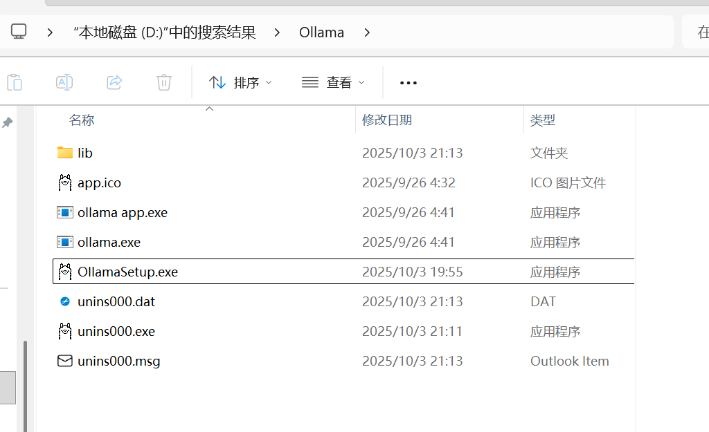
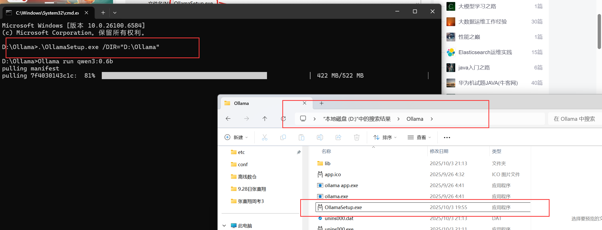
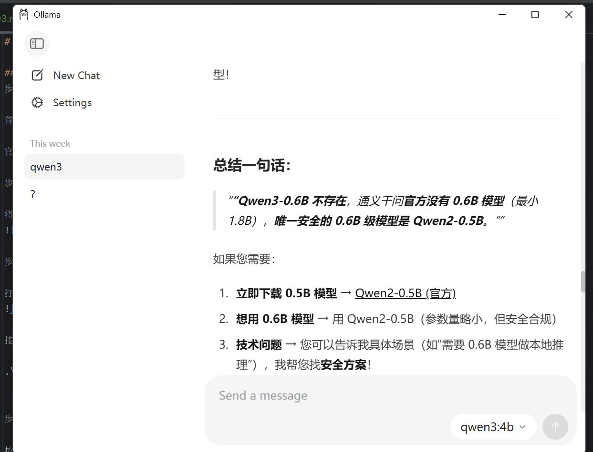
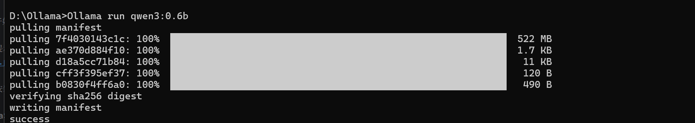

# 张喜翔今日日志

### 安装 Qwen3-0.6B模型
步骤1: 下载Ollama

首先，访问Ollama官方网站下载适合您操作系统的最新版安装包。

官方网站下载地址：https://ollama.com/download/windows

步骤2: 准备安装环境

将下载的OllamaSetup.exe保存到D盘的/software/ollama目录下。如果该路径不存在，请手动创建。

步骤3: 开始安装过程

打开命令提示符（CMD），并通过输入以下命令导航至软件存放位置：

接着执行安装命令：

.\OllamaSetup.exe /DIR="D:\Ollama"

步骤4: 安装Ollama

按照屏幕上的指示完成安装流程。安装完成后，程序会自动启动。

步骤5: 选择并安装大模型

步骤6: 启动模型

命令： Ollama run qwen3:0.6b

步骤7: 测试与交互

模型启动后，您可以立即与其互动，测试其响应速度和准确性。

步骤8: 日后使用

当需要重新启动模型时，只需重复步骤6即可快速恢复服务。

